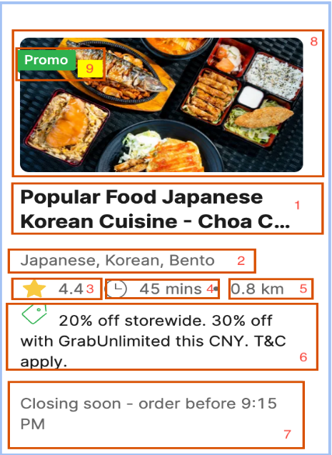

# Web Scraper for Grab Food Delivery

## Objective
The objective of this assignment is to develop a web scraper to extract specific information from the Grab Food Delivery website. This assignment aims to test your ability to understand web scraping concepts, utilize scraping libraries, and overcome challenges such as blocking and authentication in the data extraction process.

## Problem Statement
Develop a scraper to extract data from Grab Food Delivery in Singapore.

- **Website/App**: Grab Food - Singapore
- **Website Link**: [Grab Food Singapore](https://food.grab.com/sg/en/)
- **Location**: You need to enter any of the given locations to scrape the list of restaurants and their details.
  - PT Singapore - Choa Chu Kang North 6, Singapore, 689577
  - Chong Boon Dental Surgery - Block 456 Ang Mo Kio Avenue 10, #01-1574, Singapore, 560456

## Tasks
The scraper should perform the following tasks:
1. Extract the restaurant list of the selected location along with restaurant details (refer to the schema below).
2. Create a unique restaurant list.
3. Extract the delivery fee and estimated delivery time for any one of the selected locations.

## Result Format
The extracted data should be in gzip of ndjson format.

## Requirements for the Web Scraper
- Identify the scraping logic as per the given app/website.
- Develop the scraping service in any language following the below programming contracts:
  - Code should follow OOP concepts.
  - Code folder, class, and method structure should adhere to programming language standards.
  - Programming nomenclature should be followed in code.
  - Code should be highly optimized for higher load using multithreading, multiprocessing, or other paradigms for scalability.
  - Use consistent comment and logging format.
- Save the extracted data in gzip of ndjson format.

## Data to Extract
Extract all the fields/column data visible on the website/response, including:

- Restaurant Name
- Restaurant Cuisine
- Restaurant Rating
- Estimate Time of Delivery
- Restaurant Distance from Delivery Location
- Promotional Offers Listed for the Restaurant
- Restaurant Notice If Visible
- Image Link of the Restaurant
- Is Promo Available (True/False)
- Restaurant ID (e.g., 4-C2NKCETKWE5WLT)
- Restaurant Latitude and Longitude
- Estimate Delivery Fee

Ensure the scraper handles cases where the data may be structured differently on different pages.

## Documentation
- Add comprehensive comments in your code to explain the purpose of each section.
- List down the quality control (QC) performed over the extracted data.
- Include stats of data covering total count, as per the selected location, as well as not null and null stats of mandatory fields.
- Compose a brief report documenting your overall approach, methodology, challenges faced during scraping, and any improvements or optimizations envisioned.

## Submission
Submit the developed code along with the extracted data and documentation report.

## Important Notes
- Ensure compliance with the website's terms of service.
- Test the scraper on a small scale before running on a large dataset.
- Use the right proxy/VPN to access the website.

## Acceptance Criteria
- Data count should be more than 200.
- The code should compile with Multithreading/Multiprocessing.
- Documentation:
  - Approach
  - Problems faced during implementation with respective solutions/approaches
  - Steps to execute the code locally
